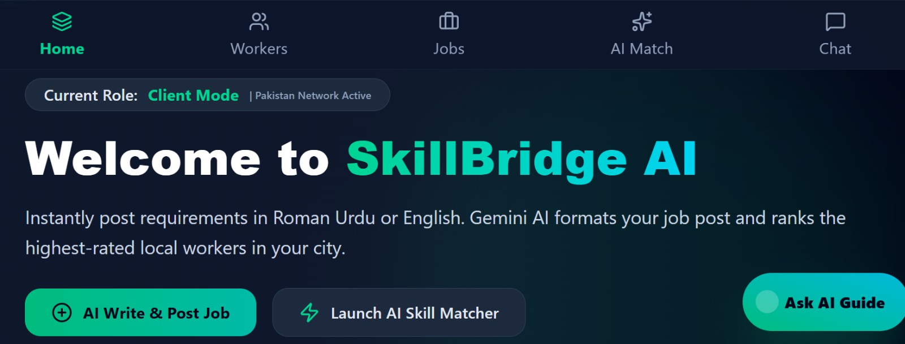
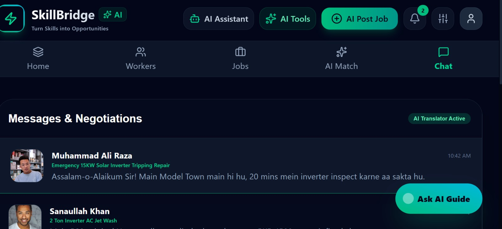
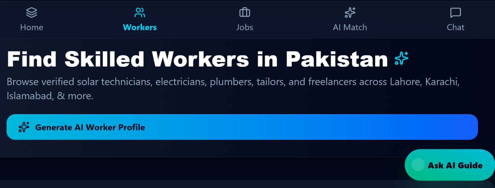

> [!IMPORTANT]
> # 🇵🇰 SkillBridge AI — Pakistan's AI-Powered Skilled Work & Freelancing Ecosystem
>
> ## 🚀 Project Overview
>
> **SkillBridge AI** is an innovative, AI-powered full-stack web platform developed to transform Pakistan's skilled workforce by creating a secure, intelligent, and transparent digital marketplace. The platform connects **clients**, **local skilled workers**, **technicians**, and **software freelancers** through advanced Artificial Intelligence, enabling users to hire trusted professionals, manage secure payments, verify work quality, and receive smart career guidance—all from one platform.
>
> 🌐 **Live Website:** **https://skillbridge-ai-by-ahsan.vercel.app**
>
> 💻 **GitHub Repository:** **https://github.com/ahsanahsan786d-bit/skill-bridge--ai/tree/main**
>
> ---
>
> ## 🎯 Project Mission
>
> Our mission is to empower Pakistan's skilled workforce by combining Artificial Intelligence with secure digital services. SkillBridge AI aims to create equal opportunities for workers, reduce unemployment, eliminate payment fraud, improve work quality, and make professional hiring faster, smarter, and safer.
>
> ---
>
> ## 🌟 Core AI Features
>
> ### 🎙️ AI Voice-to-Job Posting
> Clients can create job posts simply by speaking in **Roman Urdu** or **English**. Google Gemini AI automatically understands the spoken request and extracts:
>
> - 📍 City & Area
> - 💰 Budget (PKR)
> - 🛠 Required Skills
> - 📂 Job Category
> - 📝 Job Description
>
> Example:
>
> *"Mujhe Gulberg Lahore mein 20KW Solar Inverter Wiring ke liye experienced technician chahiye."*
>
> AI instantly converts the voice into a structured job post.
>
> ---
>
> ### 🛡️ Pakistan AI Escrow Vault
>
> Secure payment protection using:
>
> - JazzCash
> - EasyPaisa
> - SadaPay
> - Bank Transfer
>
> **Workflow**
>
> 1️⃣ Client deposits payment  
> 2️⃣ AI Escrow Vault securely locks funds  
> 3️⃣ Worker completes the job  
> 4️⃣ Client approves work  
> 5️⃣ Payment is released automatically
>
> ---
>
> ### 📸 AI Work Quality Inspector
>
> Workers upload photos after completing work.
>
> Gemini AI analyzes:
>
> - ✅ Quality Score (0–100%)
> - 🛡 Safety Report
> - 📋 AI Feedback
> - ⭐ Professional Rating
>
> Supported work includes:
>
> - Solar Installation
> - Electrical Wiring
> - Plumbing
> - Tailoring
> - AC Repair
> - CCTV Installation
>
> ---
>
> ### 🚨 AI Anti-Scam Security Scanner
>
> Automatically detects:
>
> - Fake payment requests
> - Fraud messages
> - Scam links
> - Suspicious behavior
> - Off-platform payment attempts
>
> and immediately warns users.
>
> ---
>
> ### 🎤 AI Live Technical Interview
>
> Workers can take AI-powered oral interviews.
>
> AI evaluates:
>
> - Technical Knowledge
> - Communication Skills
> - Practical Skills
> - Professional Experience
>
> Successful workers receive:
>
> 🏆 **AI Gold Certified Master Specialist**
>
> ---
>
> ### 📊 Pak-Rate 2026 Smart Price Calculator
>
> Displays estimated labour and material costs for:
>
> - Lahore
> - Karachi
> - Islamabad
> - Faisalabad
> - Multan
> - Rawalpindi
> - Peshawar
> - Quetta
>
> helping clients and workers agree on fair pricing.
>
> ---
>
> ### 🤖 AI Career & Learning Assistant
>
> Provides:
>
> - Personalized Skill Recommendations
> - Career Guidance
> - Learning Roadmaps
> - Professional Growth Suggestions
>
> ---
>
> ## 💻 Technology Stack
>
> **Frontend**
>
> - React.js
> - TypeScript
> - HTML5
> - CSS3
>
> **Backend**
>
> - Node.js
> - Express.js
>
> **Artificial Intelligence**
>
> - Google Gemini AI
> - Voice Processing
> - Multimodal Vision
> - AI Security Analysis
> - AI Recommendations
>
> **Deployment**
>
> - GitHub
> - Vercel
>
> ---
>
> ## 🌍 Live Demo
>
> 🚀 **Explore the Project Live**
>
> **https://skillbridge-ai-by-ahsan.vercel.app**
>
> ---
>
> ## 🎯 Vision Statement
>
> **SkillBridge AI is more than just a freelancing platform. It is Pakistan's vision for an AI-powered digital workforce where Artificial Intelligence, secure payments, verified skills, smart hiring, and trusted opportunities come together to empower millions of skilled professionals across the country.**
# SkillBridge AI

AI-powered job matching platform.

## Screenshots

### 1. Home Page

### 2. Chat

### 3. Worker Profile

